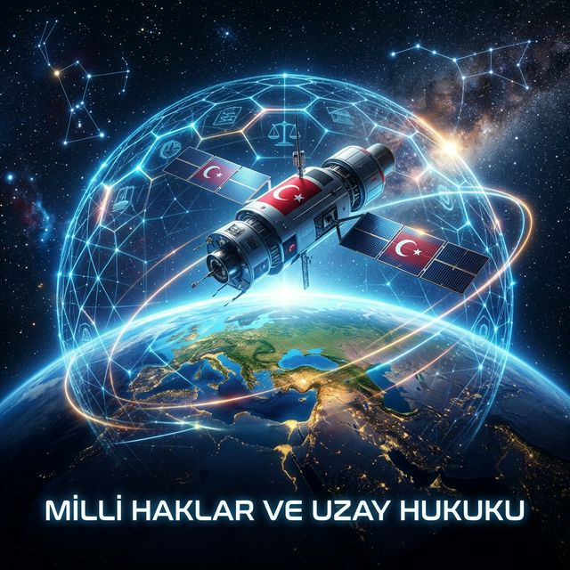
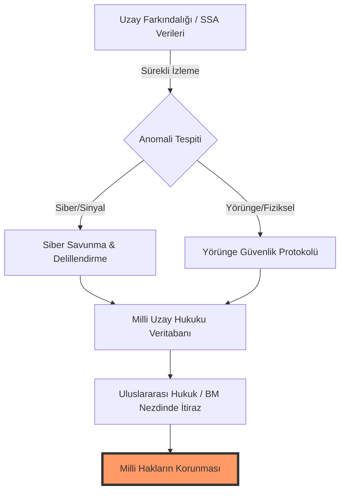
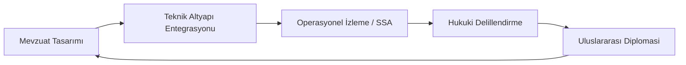
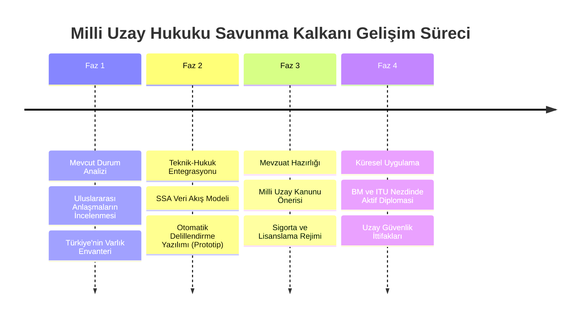

# TUA Astrohackathon 2026: Milli Hakların Savunulması & Uzay Hukuku Ecosystem

> **"Uzayda izi olmayanın, dünyada sözü olmaz. Milli haklarımızı savunmak, sadece yörüngede bir koordinata sahip olmak değil; o koordinatta barışı, adaleti ve Türk bayrağını temsil etmektir."**

---

### 🏛️ TUA Astrohackathon 2026 Resmî Proje Teslimi
**Problem Alanı:** Milli Hakların Savunulması & Uzay Hukuku
**Proje Odak Noktası:** Legal-Tech Hibrit Savunma Ekosistemi

#### 🚀 JÜRI HIZLI ERİŞİM (Quick Access)
*   **[Proje Özeti (Showcase)](file:///C:/Users/bahat/.gemini/antigravity/brain/40118242-e02b-4c60-878f-2ceb85f7b9b8/SUBMISSION_DRAFT.md):** Hackathon portalı için hazır metinler.
*   **[SSA Simulator (Teknik POC)](scripts/ssa_simulator.py):** Python tabanlı otonom ihlal tespit motoru.
*   **[Milli Uzay Kanunu Taslağı](docs/MODEL_SPACE_LAW_TURKEY.md):** Proje kapsamında hazırlanan model yasal düzenleme.
*   **[Sunum Materyalleri (Drive Hazırlık)](submission/SUBMISSION_GUIDE.md):** 7 Slaytlık içerik ve video senaryosu.

---

## 🌌 Vizyon ve Misyon
Bu depo, **Türkiye Uzay Ajansı (TUA) Astrohackathon** kapsamında "Milli Hakların Savunulması" odağında geliştirilmiş, Türkiye'nin uzaydaki egemenlik haklarını korumayı amaçlayan **dünya standartlarında bir hukuki-teknik ekosistemdir**. 

Gelecekte egemenlik, sadece karada veya denizde değil; yörünge slotlarında, frekans spektrumlarında ve derin uzay istasyonlarında savunulacaktır. Bu proje, "Göklerdeki İstikbalimiz" için bu savunmanın hem teknik hem de hukuki kalkanını inşa etmektedir.

---

## 🏛️ Stratejik Mimari: Üç Katmanlı Savunma Kalkanı (The Shield)

Projemiz, statik hukuk kurallarını dinamik Uzay Durumsal Farkındalık (SSA) verileriyle birleştiren hibrit bir savunma modelidir:

### 🎯 Milli Uzay Hukuku Döngüsü
Geleceğin "Milli Uzay Kanunu" için önerdiğimiz dinamik süreç:

---

## 📂 Kapsamlı Belgelendirme Ekosistemi

Bu depo, basit bir raporun ötesinde, derinlemesine analizler içeren bir külliyattır:

### 1. Temel Dokümantasyon
*   📜 **[Stratejik Çerçeve (Legal Framework)](docs/LEGAL_FRAMEWORK.md):** Uluslararası anlaşmalar (OST, Liability, Registration) ve Türkiye'nin konumu üzerine akademik analiz.
*   ⚖️ **[Politika Önerileri (Policy Recommendations)](docs/POLICY_RECOMMENDATIONS.md):** Türkiye'nin gelecekteki **Milli Uzay Kanunu** için somut madde ve strateji önerileri.
*   🌍 **[Executive Abstract](docs/ENGLISH_ABSTRACT.md):** International project summary for global outreach.

### 2. Teknik ve Analitik Derinlik
*   🛡️ **[Vaka Analizleri (Case Studies)](docs/TECHNICAL_CASE_STUDIES.md):** Jamming, yörünge ihlali ve siber saldırı durumlarında uygulanacak "Playbook"lar.
*   🔬 **[SSA Metodolojisi (Technical Strategy)](docs/SSA_METHODOLOGY.md):** Teknik verilerin hukuki delile dönüştürülme süreci.
*   💻 **[SSA Simulator (POC)](scripts/ssa_simulator.py):** Python tabanlı otonom ihlal tespit simülatörü (Proof of Concept).
*   📊 **[Risk Yönetim Matrisi (Risk Matrix)](docs/RISK_MANAGEMENT_MATRIX.md):** Uzay egemenliğimize yönelik tehditlerin olasılık ve etki analizleri.
*   🚨 **[Güvenlik Protokolü (Security Protocol)](docs/SPACE_SECURITY_PROTOCOL.md):** Kurumsal yanıt Standard İşleyiş Prosedürleri (SOP).

### 3. Küresel Kıyaslama ve Sürdürülebilirlik
*   ⚖️ **[Milli Uzay Kanunu Taslağı (Model Law)](docs/MODEL_SPACE_LAW_TURKEY.md):** Türkiye için kapsamlı bir yasal düzenleme önerisi (Madde madde).
*   📈 **[Küresel Kıyaslama (Benchmarking)](docs/SPACE_LAW_COMPARATIVE_ANALYSIS.md):** ABD, AB ve Lüksemburg modelleri ile Türkiye'nin hibrit yaklaşımının karşılaştırılması.
*   ♻️ **[Sürdürülebilirlik Raporu (Vision 2050)](docs/SUSTAINABILITY_REPORT.md):** Uzay enkazı yönetimi ve gelecek nesillerin yörünge hakları üzerine uzun vadeli vizyon.
*   ✅ **[Denetim Listesi (Compliance)](docs/COMPLIANCE_CHECKLIST.md):** Uzay faaliyeti yürütecek yerli firmalar için hukuki uyumluluk rehberi.

### 4. Akademik Altyapı & Küresel Erişim
*   🇬🇧 **[English Whitepapers (International)](docs/en/STRATEGIC_FRAMEWORK.md):** Global audience analytical abstracts.
*   📑 **[TUA Hedef Uyumu (National Alignment)](docs/TUA_ALIGNMENT.md):** Projenin Milli Uzay Programı'ndaki 10 hedefle doğrudan eşleşme analizi.
*   📚 **[Akademik Kaynakça (Bibliography)](docs/RESEARCH_BIBLIOGRAPHY.md):** Kullanılan uluslararası kaynaklar, regülasyonlar ve literatür.
*   📖 **[Terimler Sözlüğü (Glossary)](docs/GLOSSARY.md):** Uzay hukuku ve teknolojisi kavram rehberi.

---

## 🗺️ Proje Yol Haritası (Roadmap)

---

## 🚀 Astrohackathon Hakkında
Astrohackathon, uzay ve havacılık tutkunlarının bir araya gelerek yenilikçi fikirler geliştirebilecekleri bir platformdur. Bu proje, "Astrohackathon: Milli Hakların Savunulması" problemi için **uçtan uça bir çözüm** olarak tasarlanmıştır.

### ⏱️ Geliştirme Yolculuğu (48 Saatlik Maraton)
Bu proje, 48 saatlik yoğun bir çalışma sonucunda, sıfır noktasından dünya standartlarında bir ekosisteme dönüştürülmüştür:
1.  **0-12 Saat:** Problem tanımı ve "Üç Katmanlı Kalkan" modelinin teorik inşası.
2.  **12-24 Saat:** Milli Uzay Hukuku Whitepaper'larının (Legal Framework, Policy Recommendations) hazırlanması.
3.  **24-36 Saat:** Teknik kanıt katmanının (`ssa_simulator.py`) otonom tespiti için Python POC geliştirilmesi.
4.  **36-48 Saat:** Küresel benchmarking, risk matrisleri ve sunum materyallerinin finalizasyonu.

## 🤝 Katkı Sağlama
Geleceğin uzay hukukunu birlikte inşa etmek için [katkı sağlama rehberine](CONTRIBUTING.md) göz atabilirsiniz.

---
*Bu çalışma, Türkiye Uzay Ajansı'nın "Göklerdeki İstikbalimiz" vizyonuna adanmıştır.*
