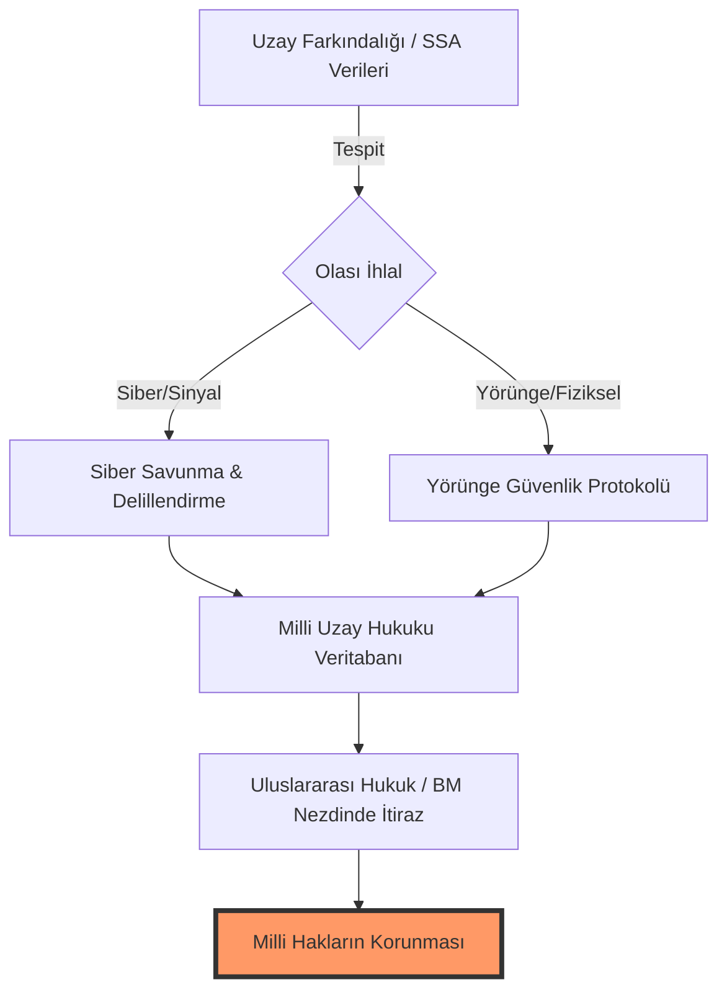
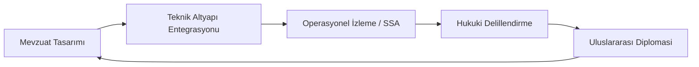

# TUA Astrohackathon: Milli Hakların Savunulması & Uzay Hukuku

## 🌌 Proje Hakkında
Bu depo, **Türkiye Uzay Ajansı (TUA) Astrohackathon** kapsamında "Milli Hakların Savunulması" odaklı Uzay Hukuku problemi için geliştirilen kapsamlı politika önerilerini, stratejik yol haritasını ve araştırma çıktılarını içermektedir. 

Geleceğin dünyasında egemenlik, sadece karada, denizde ve havada değil; uzayın derinliklerinde, yörünge slotlarında ve frekans spektrumlarında savunulacaktır.

---

## 🏛️ Stratejik İçerik

### 1. Yüksek Düzey Özet (Executive Summary)
Projemiz, Türkiye'nin uzaydaki milli çıkarlarını (yörünge hakları, frekans tahsisleri, uzay varlıklarının siber güvenliği) savunmak için **"Üç Katmanlı Hukuki-Teknik Savunma Kalkanı"** (Three-Layered Legal-Tech Defense Shield) modelini önermektedir. Bu model, statik hukuk kurallarını dinamik uzay farkındalığı (SSA) verileriyle birleştirerek, olası ihlallere karşı anında hukuki delillendirme ve diplomatik yanıt mekanizması sağlar.

### 2. Üç Katmanlı Savunma Mimarisi
Aşağıdaki diyagram, teknik verilerin hukuki argümanlara nasıl dönüştüğünü özetlemektedir:

### 3. Milli Uzay Hukuku Döngüsü
Geleceğin "Milli Uzay Kanunu" için önerdiğimiz dinamik süreç:

### 4. Teknik Yaklaşım & Metodoloji
Multidisipliner bir yaklaşım sergileyerek, hukuk ve politikayı bir "sistem mimarisi" olarak ele alıyoruz:
*   **Veri Odaklı Politika Tasarımı:** Uzay enkazı ve yörünge çakışmalarının analiz edilerek hukuki argümanların bu verilere dayandırılması.
*   **Sistem Optimizasyonu:** Ulusal uzay politikalarının, uluslararası yasal çerçevelerle (yapay zeka karar destek sistemleri kullanılarak) optimize edilmesi.

---

## 📂 Kapsamlı Belgelendirme (Ecosystem)
*   📜 **[Stratejik Çerçeve (Legal Framework)](docs/LEGAL_FRAMEWORK.md):** Uluslararası anlaşmalar ve Türkiye'nin konumu üzerine detaylı analiz.
*   ⚖️ **[Politika Önerileri (Policy Recommendations)](docs/POLICY_RECOMMENDATIONS.md):** Milli Uzay Kanunu için somut yasal tavsiyeler.
*   🛡️ **[Vaka Analizleri (Case Studies)](docs/TECHNICAL_CASE_STUDIES.md):** Olası kriz anlarında siber ve teknik yanıt senaryoları.
*   🔬 **[SSA Metodolojisi (Technical Strategy)](docs/SSA_METHODOLOGY.md):** Teknik verilerin hukuki delile dönüştürülme süreci.
*   📑 **[TUA Hedef Uyumu (National Alignment)](docs/TUA_ALIGNMENT.md):** Milli Uzay Programı hedefleri ile projenin entegrasyonu.
*   ✅ **[Denetim Listesi (Compliance)](docs/COMPLIANCE_CHECKLIST.md):** Uluslararası standartlarda uyumluluk kontrol listesi.
*   📚 **[Akademik Kaynakça (Bibliography)](docs/RESEARCH_BIBLIOGRAPHY.md):** Kullanılan uluslararası kaynaklar ve referanslar.
*   🌍 **[English Abstract](docs/ENGLISH_ABSTRACT.md):** International project summary.
*   📖 **[Terimler Sözlüğü (Glossary)](docs/GLOSSARY.md):** Uzay hukuku ve teknolojisi kavram rehberi.
*   🤝 **[Katkı Sağlama Rehberi](CONTRIBUTING.md):** Araştırmaya nasıl destek verebilirsiniz?

## 🚀 Astrohackathon Hakkında
Astrohackathon, uzay ve havacılık tutkunlarının bir araya gelerek yenilikçi fikirler geliştirebilecekleri bir platformdur. Bu proje, "Göklerdeki İstikbalimiz" için hukuki bir temel atmayı amaçlar.

---
*Bu çalışma bir politika araştırma raporu olup, teknik çıktılar ve belgeler bu depo üzerinden yönetilmektedir.*